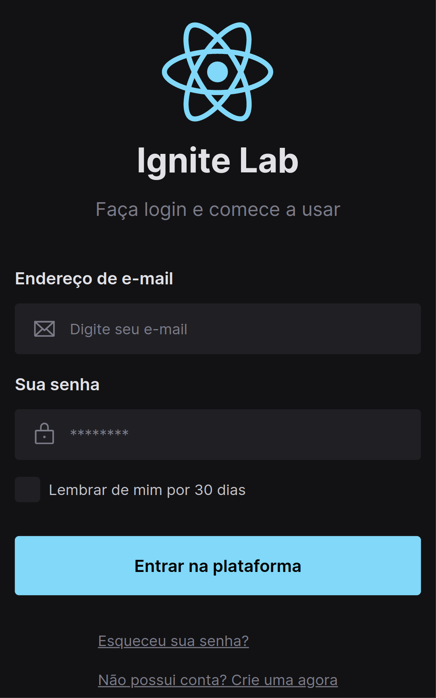

# React Design System

This project implements a design system using ReactJS and Tailwindcss.

The design was first made using Figma ([see design](https://www.figma.com/file/IYRxEKnphJzWgVdY3UpfeS/Ignite-Lab-Design-System)) and then tranfered to ReactJS + Tailwindcss, component by component.
You can see the results [here](https://germanyn.github.io/react-design-system/?path=/story/components-signin--default) aswell each component separately.